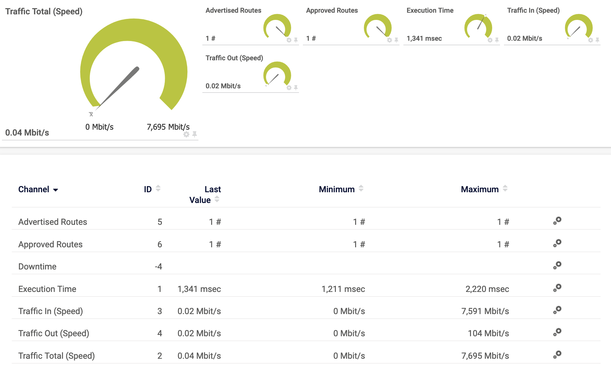

# PRTG Sensor for Tailscale

A script that can be used as a PRTG [SSH Advanced Sensor](https://www.paessler.com/manuals/prtg/ssh_script_advanced_sensor) for [Tailscale Client Metrics](https://tailscale.com/kb/1482/client-metrics).



## Caveats

The sensor is only supported on Linux platforms with the following channels available:
* Traffic total (Mbps)
* Traffic in (Mbps)
* Traffic out (Mbps)
* Advertised routes
* Approved routes

## Requirements

* Tailscale v1.78.0+
* Python 3.7+

## Instructions

On the monitored system, create the PRTG script directory and copy ```tailscale.py``` file there.
```
# mkdir -p /var/prtg/scriptsxml
# cd /var/prtg/scriptsxml
# wget https://raw.githubusercontent.com/Fluent-networks/tailscale-prtg/refs/heads/main/tailscale.py
# chmod 755 tailscale.py
```

On your PRTG system create a Device using the host IP address and specify the SSH credentials under **Credentials for Linux/Solaris/macOS (SSH/WBEM) Systems**.

Add a **SSH Script Advanced Sensor**. In the Sensor Settings choose **tailscale.py** as the script. Set the required Scanning Interval as needed.


